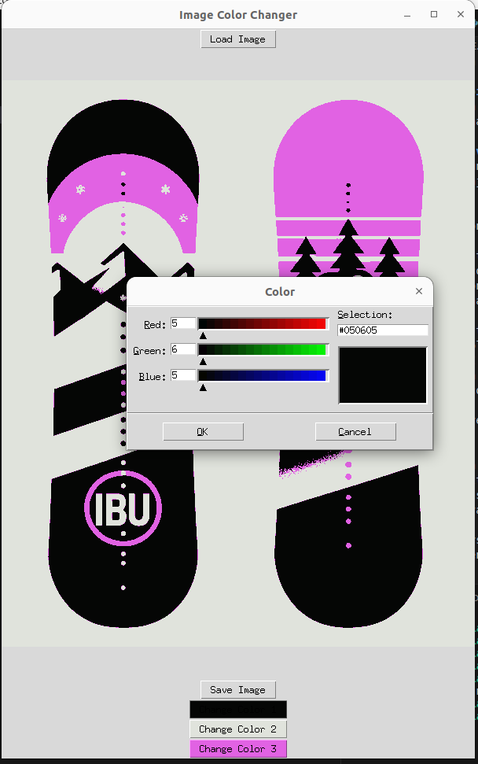

# Lumilaudan suunnittelua

## Dokumentointi
Hakemistossa doc löytyy mm. Slack kanavalla julkaisemani pdf, josta löytyy promptit lumilauta-designien tekoon Dall-E:lla.
Myöhemmin saatan lisätä vielä jotain.

## Uudelleenväritys
Lisäkikkailuna halusin tehdä vempeleen, jolla voi koittaa eri värejä. Kokeilin venyttää
copilotin rajoja. Alkuperäinen prompti oli:

...
Create python based GUI that can be used to select new colors to image. 

As a first stage, code reads image from file using "load button".
After this code searches three most representative colors for the image. 
Then code converts image to use just these three colors. Each pixel is chosen to be one of these colors.
The color that is closest in R2 norm sense is chosen. 

The user is then able to change any of these three colors using GUI. 
All three colors are representated as separate items in GUI.  
Items in GUI allow one to select new colors. Used colors are the ones 
described in https://www.rapidtables.com/web/color/RGB_Color.html in section "RGB color table". 
The actual color is presented in GUI. 

User may save the image with modified colors. 
...

Ihan putkeen ei mennyt copilotin koodi. Ja jouduin kyselemään virheistä. Se ei esimerkiksi ottanut
huomioon, että värikanavia voi olla 3 tai 4. Värin valintakaan ei toiminut. Lisäksi mm. mustan värin
muuttaminen saattoi muuttaa alkuun valkoista väriä. Tässä vaiheessa luovutin ChatGPT:n kanssa, koska
ns. tiesin vastauksen itse helpommin, koska olen jonkin verran Tkinterin kanssa kikkaillut.

Nykyinen versio koodista (recolor.py) on ohessa. Koodi siis lataa kuvan ja klusteroi KMeans-algoritmilla 
(näemmmä) sen 3:ksi väriksi. Koodin saa helposti toimimaan myös 4:llä värillä (tms) muuttamalla riviä 55:

...
kmeans = KMeans(n_clusters=4)
...

